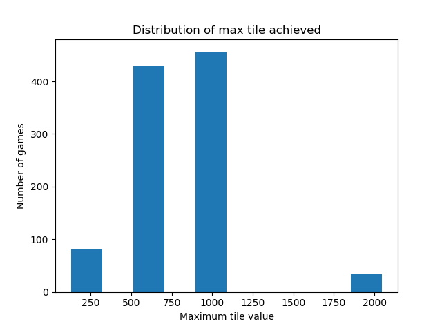

# Solving 2048 using Reinforcement Learning
This repository aims to build multiple reinforcement learning agents using different techniques to play the well-known 2048 game! As more and more methods are covered, I will try to compare the different approaches in terms of performance and probability of success.

## Visualizations
Here's a quick demo of the RL agent playing the game!


Yeah, sadly it's not very good yet. A part of that is because I haven't been able to train the model for very long (I only have a MX150). So if anyone has a great GPU and wants to share their model, you're welcome to do so! I will try to train the model further, but I think it might be a better idea to try new methods.

Below are some analysis results based on 1000 games played by the RL Agent.

<center>

 Dist. of maximum tiles reached       |  Dist. of max score reached
:-------------------------:|:-------------------------:
  |  
</center>

## Running the code
* To play the game on your own:
```shell
$ python gui.py
```
* To make the RL Agent play the game:
```shell
$ python algoTest.py --cfg cfgs/SimpleRL.yaml --viz
```
* To re-compute the analysis results above:
```shell
$ python algoTest.py --cfg cfgs/SimpleRL.yaml --n_runs 1000
```
* To train your own model (will save a checkpoint every 25 epochs):
```shell
$ python simpleRL.py
```

## Todo
- [x] Build initial game code to allow human players
- [X] Extend game mechanics to allow reinforcement learning agents
- [X] Build a simple reinforcement learning agent to play the game
- [ ] Improve the performance of the RL Agent